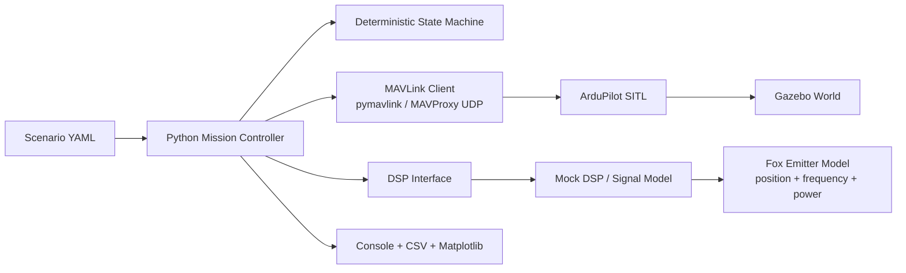
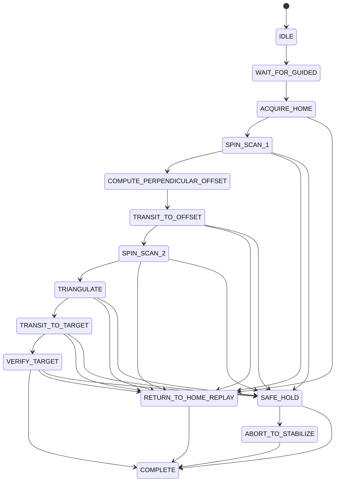

# DemoDronePilot

Production-style prototype repository for a drone RF fox-hunting simulator built around:

- ArduPilot SITL
- Gazebo for 3D simulation
- MAVLink / MAVProxy integration
- Python autonomous mission logic
- Python mock DSP/RF detection pipeline

The simulated mission flies a quadcopter in `GUIDED`, performs two directional spin scans with a Yagi-style antenna model, triangulates a stationary 915 MHz emitter, and then flies toward the estimated fox location. Failure paths for low battery, DSP timeout/crash, and invalid triangulation are included.

## Architecture



## Mission State Flow



## Repository Layout

```text
README.md
Makefile
requirements.txt
config/
scripts/
sim/
src/
```

Key modules:

- `src/mission_controller.py`: mission orchestration and failure handling
- `src/mavlink_client.py`: mock backend plus `pymavlink` SITL client
- `src/rf/dsp_interface.py`: swappable DSP seam for future SDR integration
- `src/rf/mock_dsp.py`: synthetic IQ-derived detection stand-in
- `src/rf/bucket_sampler.py`: 360-degree scan bucket collection
- `src/rf/triangulation.py`: bearing-line least-squares estimate and stability rejection
- `src/flight/path_recorder.py`: commanded path history
- `src/flight/rth_replay.py`: reverse-path return-to-home planner
- `src/telemetry/logger.py`: console and CSV logging
- `src/telemetry/plot_export.py`: mission plot export

## Quick Start

### Ubuntu / Linux

1. Clone this repository.
2. Run:

```bash
make setup-linux
source .venv/bin/activate
```

3. Launch the integrated demo:

```bash
make run-demo
```

The default integrated path starts Gazebo, starts ArduPilot SITL through `sim_vehicle.py` and MAVProxy, then runs the Python mission controller against `udp:127.0.0.1:14550`.

For the full fox-hunt 3D world with the visual fox marker placed in the runway scene, use:

```bash
make run-live-3d
```

### macOS

1. Install Homebrew first if needed.
2. Run:

```bash
make setup-macos
source .venv/bin/activate
```

3. Launch a local mock-only dry run:

```bash
BACKEND=mock make run-demo
```

4. If your local ArduPilot + Gazebo setup is healthy, run the integrated path:

```bash
make run-demo
```

For the real SITL + Gazebo + MAVProxy fox-hunt scene on macOS, use:

```bash
make run-live-3d
```

The repository uses env-driven dependency roots so Linux and macOS differ mostly by tool installation, not by Python source layout:

- `DEPS_DIR`
- `ARDUPILOT_HOME`
- `ARDUPILOT_GAZEBO_HOME`
- `VENV_DIR`

## Common Commands

```bash
make install
make setup-linux
make setup-macos
make run-demo
make run-live-3d
make run-failure-demo
make test
```

Failure scenarios:

- `config/scenario_low_battery.yaml`
- `config/scenario_dsp_failure.yaml`
- `config/scenario_invalid_triangulation.yaml`

Examples:

```bash
./scripts/run_failure_demo.sh
./scripts/run_failure_demo.sh config/scenario_dsp_failure.yaml
python3 -m src.main --scenario config/scenario_invalid_triangulation.yaml --backend mock --plot
```

## Scenario Model

Each scenario YAML controls:

- home position in local meters
- fox emitter position, or a repeatable randomized fox within a configured radius of home
- mission settings such as bucket interval, scan altitude, the initial perpendicular offset, and refinement passes
- battery drain and low-battery threshold
- DSP noise, outliers, timeout/crash injection, and bearing bias
- forced invalid triangulation for robustness testing

For the default and live demo scenarios, edit `config/scenario_default.yaml` or `config/scenario_live_sitl.yaml`:

- `fox.position` for a fixed fox location
- `fox.randomize_within_miles` for a repeatable random fox around the drone home point
- `random_seed` to change which random fox location is chosen

The Gazebo launch scripts now render a temporary world file from the selected scenario so the visual fox marker follows the same resolved fox position.

The simulator currently uses a local planar frame:

- `x`: east-like local meters
- `y`: north-like local meters
- `z`: up in meters
- scan yaw / bearing: degrees in the local XY plane, `0 deg` aligned to `+x`

## How the Demo Works

1. Acquire home and take off to scan altitude.
2. Perform `SPIN_SCAN_1` by yawing through `0..359` and collecting bucketed RF measurements.
3. Estimate the first bearing from the bucket sweep.
4. Fly to a perpendicular offset waypoint.
5. Perform `SPIN_SCAN_2`.
6. Triangulate the fox location from the scan origins and estimated bearings.
7. Fly toward the estimate and verify against simulation truth.
8. If battery crosses threshold, stop the mission and replay the recorded waypoint path in reverse.
9. If DSP fails or triangulation is rejected, enter `SAFE_HOLD` or `ABORT_TO_STABILIZE`.

## Logs and Artifacts

Each run writes a timestamped directory under `artifacts/` with:

- `state_transitions.csv`
- `measurements.csv`
- `triangulation_estimates.csv`
- `path_trace.csv`
- `mission_plot.png` when `--plot` is enabled

Console output mirrors state changes, scan summaries, triangulation health, and failure reasons.

## SITL / Gazebo Notes

- `sim/launch/launch_gazebo.sh` configures `GZ_SIM_RESOURCE_PATH` and `GZ_SIM_SYSTEM_PLUGIN_PATH`.
- `sim/launch/launch_sitl.sh` launches `sim_vehicle.py` with a Gazebo frame and can either use its built-in MAVProxy handling or run SITL only.
- `sim/launch/launch_mavproxy.sh` runs a standalone MAVProxy bridge for stable non-interactive 3D launches.
- `scripts/run_demo.sh` starts Gazebo and SITL first, then launches `python -m src.main`.
- `scripts/run_live_sitl_gazebo_fox_hunt.sh` starts Gazebo, SITL, MAVProxy, and the live fox-hunt mission against `sim/world/fox_hunt_iris_runway.sdf`.
- The repo also supports `--backend mock` for local development and CI-style testing when external simulation is unavailable.

`sim/world/fox_hunt_world.sdf` and `sim/world/models/fox_beacon/` provide a simple local world asset and emitter marker. In a full ArduPilot Gazebo run, the official `ardupilot_gazebo` world may still be the best default launch target depending on your plugin/model install.

## Where Real SDR / IQ Integration Fits

The replacement seam is intentional:

- `src/rf/dsp_interface.py` defines the stable contract.
- `src/rf/mock_dsp.py` is the synthetic implementation.

To connect a real SDR-backed service later, keep the mission controller unchanged and replace `MockDspPipeline.measure(...)` with a transport call that returns:

- correlation score
- RSSI
- inferred bearing or bucket measurement

Good future transport options include gRPC, ZeroMQ, or a local IPC socket between the flight-control process and an SDR coprocessor service.

## Next Steps To Connect Real Hardware

- Replace `MockDspPipeline` with a service that consumes live RTL-SDR or other SDR IQ streams and publishes detections through `DspPipeline`.
- Swap the mock/local frame assumptions for GPS or EKF-origin coordinates and map them into real MAVLink frames.
- Read actual battery telemetry over MAVLink instead of using the internal drain model.
- Add antenna boresight calibration, yaw-settle timing, and servo or gimbal control if the Yagi is not rigidly body-fixed.
- Move `PymavlinkClient` from SITL UDP to serial, telemetry radio, or companion-computer networking on the real aircraft.

## Known Limitations Of Simulation Vs Real RF

- The RF model is intentionally simple: directional gain, inverse-distance attenuation, gaussian noise, and optional outliers.
- No multipath, polarization mismatch, terrain shadowing, cable losses, front-end compression, or urban clutter is modeled.
- Bucket scans assume clean yaw knowledge and near-instant heading settle.
- Triangulation is done in a flat local XY plane, not over geodesic coordinates.
- Verification uses simulation truth; real hardware would require a separate confirmation strategy.

## Test Coverage

The included test suite covers:

- bucket aggregation and strongest-bearing selection
- triangulation success and unstable-line rejection
- reverse replay path generation
- low-battery mission interruption and replayed return home
- DSP timeout failure handling

Run with:

```bash
make test
```

## Reference Docs

The setup scripts and launch conventions in this repo are aligned with the current upstream docs and repos:

- [ArduPilot](https://github.com/ArduPilot/ardupilot)
- [ardupilot_gazebo](https://github.com/ArduPilot/ardupilot_gazebo)
- [MAVProxy docs](https://ardupilot.org/mavproxy/index.html)
- [Gazebo docs](https://gazebosim.org/docs)
